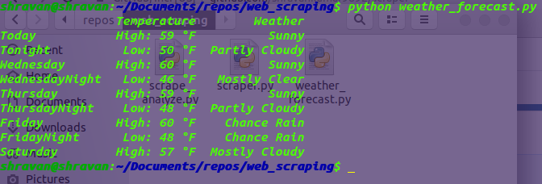

# scraper
Web Scraping in different possible ways.
Just experimenting as of now, feel free to push any unique || useful web scraping code here :)

(1) Scrapping a weather forecasting [website](https://forecast.weather.gov/MapClick.php?lat=37.7772&lon=-122.4168#.XBAKJy4zbdh):

